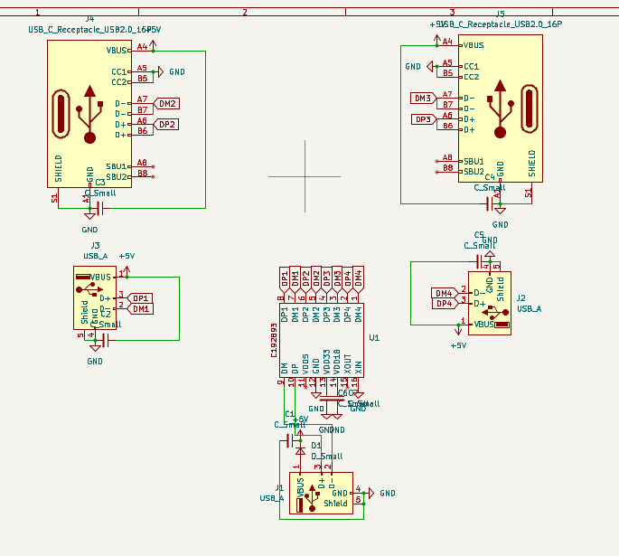
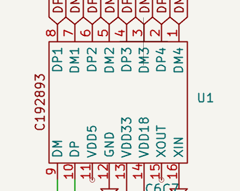
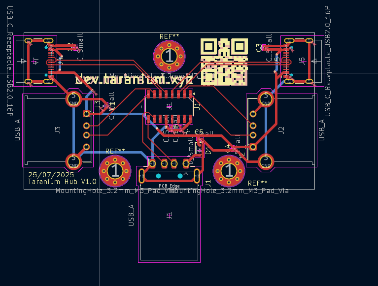
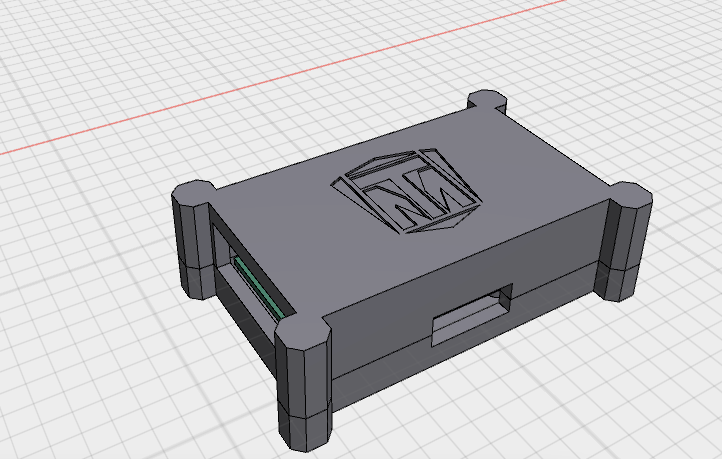
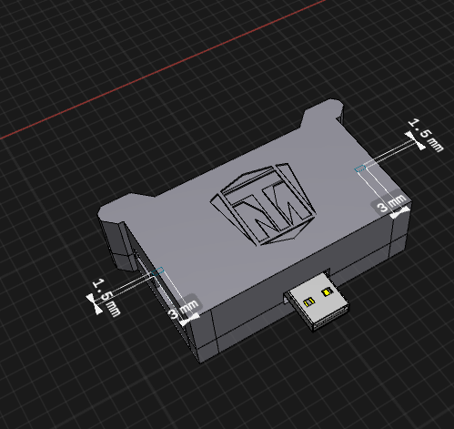
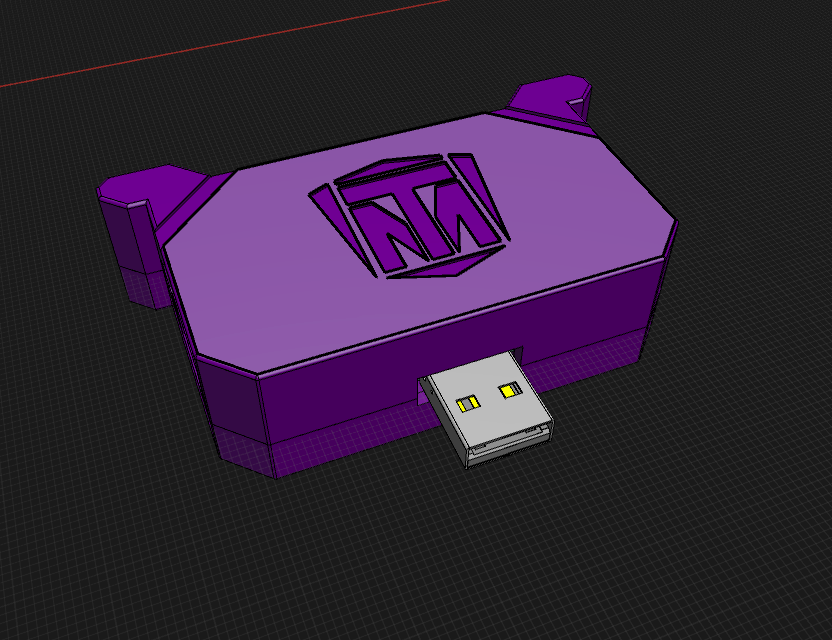

# Taranium Hub

A USB hub thats super cool and stuff.\
its gonna have 2 usbA and 2 usbC

Total time spent: 7 hours

## 24th July

Okay gonna speedrun a usb hub since the one i got from onboard doesnt work.

Step 1 pcb.

first i need to make a symbol for the chip thingy because kicad doesnt have one.

Next I need to do parts research for the ports im gonna get.

gonna do 2.0 ports for the usba and 16pin ports for the usbc

next i start wiring all the ports together. it isnt too hard it is pretty quick.

the diode is for surge protection

the caps are for decoupling. whatever that means

okay now with the schematic done its time for pcb. for this design I am thinking to have it so its 2 ports on either side of the male port so it can kinda be reverseable

anyways I placed all the parts to where they would roughly go, and made all the connections. the power lines use 0.5mm traces so they can handle more amps and yeah qr code goes to a non-existant website.

Case time :D

For the case I started with a box around the pcb and then added 4 corner thingies for the screw holes because I thought it looked cool.

forgot to take a photo because i was tired but thats all i did today

Time spent: 2 hours

## 25th of july

Okay I finished up on the case. I removed 2 of the corner thingies because I realised that it would get in the way of plugging it in. which isnt good. 

so now its only 2 screws holding it in on one side but from previous experience, That should probably be more than enough.

II also added my logo to the hub

looks nice

and changed the details of the prongs a bit

okay time to do bom and readme stuffs.

WHY THE EVERLIVING HELL DOES JLCPCB KEEP REJECTING MY BOM AND CPL FILWAf
jaslkfhsdajklfsdk

i wanna die

I have remade the gerbers like 3 times

wtf is wrong :sob:

WAIT OKAZY I FOUND SOMTING AFTR 30 MINS OF PAIN

so kicad doesnt do proper jlc style cpl and bom files so you need to import into google sheets and do it manually

anyways finally got that done and damn thats not as bad as I thought

I had to change the usb port I use though because the original one is out of stock

Other than that its all done

Time Spent: 3 hours

## 26/27th July

Its during night so im merging the days

anyways i was told to round the corners on my case and add differencial routing. which i did. it was fun to learn tbh.

pretty easy to implement as well. just make your line wibbly wobbly until the track lengths of the 2 traces match. and dont do any 90 degree stuffs.

also for the corner rounding. corner rounding bad. i did chamfered corners instead and put a .5mm fillet because it is still a rounded corner and it count. but is barely noticeable. so win win

Hours spent: 2

