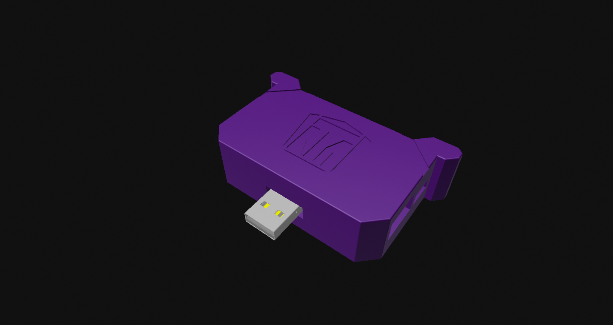
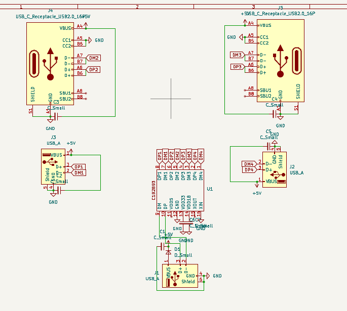
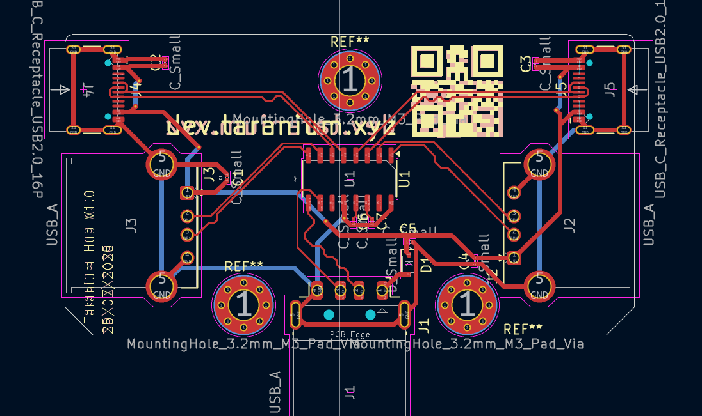

# Taranium Hub

A USBa Hub designed by @Overlord-Runt // Taran The Idiot

## The Taranium USB Hub

This is a 4 port usb hub with 2 USBa ports and 2 USBc ports. It has a pair of A and C on each side of the board, allowing it to be reversable.

## PCB
### Schematic

The schematic uses a custom made symbol for the ic and is wired up to normal datasheet requirements. It boasts the ability to have 2 USBa and 2 USBc ports.

### PCB

Here you can see the pcb design files for this project.

The power lines use 0.5mm traces due to the extra current.

## CAD

This is the case for the USB Hub.\
It has just 2 parts and has a relatively simplistic design that still looks nice and detailed.\
It only uses 2 screws because In my experince that is more than enough and it also has no space to add any more.

It is recommended to print in PETG due to the amount of heat that the hub gives off.

## BOM

|Item|Qty|Price(USD)|Source|Notes|
|----|---|----------|------|-----|
|PCB|5|$5|JLCPCB||
|PCBa+shipping|5|$40|JLCPCB||
|USBa Male|1||https://jlcpcb.com/partdetail/Korean_HropartsElec-U_G_O4DD_W1/C98125||
|USBa Female|2||https://jlcpcb.com/partdetail/47411-903131A1011D10100/C46407||
|USBc Female|2||https://jlcpcb.com/partdetail/HOAUC-HYCW412_USBC16065B/C5342196||
|10µf Capacitor|7||https://jlcpcb.com/partdetail/20411-CL10A106KP8NNNC/C19702||
|USB Hub Chip|1||https://lcsc.com/product-detail/USB-ICs_CoreChips-SL2-1A_C192893.html||
|3d printed case|1||3d printer||
|M3W5L6 Heatsets|7|1.7|https://www.aliexpress.com/item/1005003582355741.html?spm=a2g0o.order_list.order_list_main.50.21221802eFqViq||
|M3 6mm screws|3|1.52|https://www.aliexpress.com/item/32810852732.html?spm=a2g0o.order_list.order_list_main.28.21221802eFqViq||
|M3 12mm screws|4|2.05|https://www.aliexpress.com/item/32810852732.html?spm=a2g0o.order_list.order_list_main.28.21221802eFqViq||
|Total||$50|||
